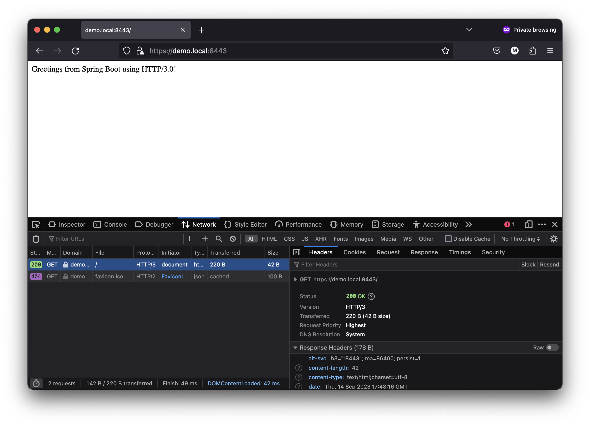

# Spring Boot HTTP/3 Jetty Demo

This guide shows how to use HTTP/3 with Spring Boot and Jetty. **There is no "TL;DR" here**, as you should 
read the entire guide to learn how to experiment with HTTP/3. This is an involved process to have a fully
working demo.

This demo uses Jetty's HTTP/3 implementation and more information can be found in this [article](https://webtide.com/jetty-http-3-support/). 
If you want to learn more on the details of HTTP/3, this [blog series](https://www.smashingmagazine.com/2021/08/http3-core-concepts-part1/) is highly recommended!

> WARNING: This is a highly experimental demonstration of HTTP/3 using Spring Boot and Jetty.
> Do not use for production applications!
 
> This guide assumes that you are running on macOS Ventura 13.5.x or later and already have `brew` installed.
> You may have problems using other versions of macOS or with Linux. Windows is an unknown.

> This guide requires Firefox for the browser demo. Chrome and Safari do not work, as they do not support the use 
> of self-signed SSL certificate with HTTP/3. You need a real TLS 1.3 certificate for those browsers.

> This guide assumes that you are running Java 20 or newer, but Java 17 may work, just update the `java.version` 
> in the `pom.xml` to try). No Java 20 Java language features are used in this project.

> This demo application requires using Spring Boot 3.2 M3 or later so Jetty 12.0.1 can be used.
> Note: this current version uses snapshot builds of M3 and will be removed when M3 is released.

## (Recommended) Build `curl` with HTTP/3 Support

You may want to build a version of `curl` to play with HTTP/3 but this is optional, as a browser also works just for
demonstration purposes. There is not yet an easily installed binary of `curl` with HTTP/3 enabled. The official docs for 
building `curl` for HTTP/3 are found [here](https://github.com/curl/curl/blob/master/docs/HTTP3.md).

`curl` can be built with a custom `.rb` script using `brew`. This may take a long time to build. The script
originated from CloudFlare [here](https://raw.githubusercontent.com/cloudflare/homebrew-cloudflare/master/curl.rb) and was tweaked because of a [build error](https://github.com/curl/curl/issues/11850) that will be fixed shortly.

```shell
brew install --HEAD -s curl/curl.rb
```

Then you need to add this version of `curl` to  your `$PATH`:

```shell
export PATH="/opt/homebrew/opt/curl/bin:$PATH" >> ~/.zshrc
source ~/.zshrc
which curl
```
Expected output `/opt/homebrew/opt/curl/bin/curl`. If you want to go back to the original system `curl` just remove 
the `export` from your `~/.zshrc`.

Now, check that `curl` supports HTTP/3:
```shell
curl --version
```

Expected output:
```
/0.18.0 librtmp/2.3 OpenLDAP/2.6.6
Release-Date: [unreleased]
Protocols: dict file ftp ftps gopher gophers http https imap imaps ldap ldaps mqtt pop3 pop3s rtmp rtsp scp sftp smb smbs smtp smtps telnet tftp
Features: alt-svc AsynchDNS brotli GSS-API HSTS HTTP2 HTTP3 HTTPS-proxy IDN IPv6 Kerberos Largefile libz MultiSSL NTLM NTLM_WB SPNEGO SSL threadsafe UnixSockets zstd
```

We will come back to using `curl` later in this guide.

## (Required) Add `demo.local` to your `/etc/hosts`

HTTP/3 requires a valid TLS 1.3 (SSL) certificate with a matching SNI. This project already contains a self-signed 
TLS 1.3 certificate for a `demo.local` domain name. You must add a loopback to your `/etc/hosts` in order for this 
demo to work.

Run `sudo nano /etc/hosts` and enter your password.

Add to the file, as desired:
```
127.0.0.1       demo.local
```
Exit and save.

Now run this command so the `demo.local` will work:
```shell
sudo killall -HUP mDNSResponder
```

We will come back to using `demo.local` later in this guide.

## (Required) Build and Run the Demo Application

You can run this command to start up the application:

```shell
 ./mvnw clean compile spring-boot:run
```

In the logs, you will be able to see that Jetty is used, and that HTTP/1, HTTP/2, and even HTTP/3 are listening on 
port 8443.

```
2023-09-14T09:27:01.102-07:00  INFO 31070 --- [           main] o.s.b.web.embedded.jetty.JettyWebServer  : Jetty started on ports 8443 (ssl, alpn, h2, http/1.1), 8443 (h3) with context path '/'
```

You should explore the following files to see how Jetty and SSL was set up and configured:

1. `pom.xml`
2. `src/main/java/com/example/demo/JettyConfiguration.java`
3. `src/main/resources/application.properties`

The official docs for using HTTP/3 with Jetty can be found [here](https://eclipse.dev/jetty/documentation/jetty-11/programming-guide/index.html#pg-server-http-connector-protocol-http3).

Note that this uses Spring Boot's [SSL Bundles](https://spring.io/blog/2023/06/07/securing-spring-boot-applications-with-ssl) 
to set up the certificates. This allowed for reusability in setting up SSL for Jetty's HTTP/3 `HTTP3ServerConnector`
by injecting `DefaultSslBundleRegistry`.

You should explore the following files as well to see the full implementation:

1. `src/main/java/com/example/demo/HelloController.java`
2. `src/main/java/com/example/demo/AddResponseHeaderFilter.java`

The `Alt-Svc` header is added to alert a HTTP client that HTTP/3 is supported, and to use HTTP/3 for subsequent calls.
You will observe this later in the demo.

## (Required) Access Demo from Firefox

As stated in the disclaimer above, Chrome and Safari will not work for this demo. You must use Firefox.

Here is the process for the demo:

1. Open https://demo.local:8443 using Firefox
2. Click "Accept the Risk and Continue" due to the self-signed certificate
3. Right click and select "Inspect" in the menu
4. Go to the "Network" tab
5. Click the Reload button in the URL bar
6. Right click the table header (i.e. Status)
7. Select "Protocol" from the menu
8. Observe that HTTP/2 was used for this first page load
9. Click the Reload button in the URL bar again
10. Observe that HTTP/3 was used for the second page load (if still HTTP/2, try to reload again)
11. Click on the HTTP request in the "Network" panel to open the "Headers" panel
12. Observe the `alt-svc h3=":8443"; ma=86400; persist=1` header with `h3` to inform the browser HTTP/3 is supported

The outcome of the demo is shown in this screenshot:



## (Recommended) Using `curl` with `--http3` and `alt-svc`

Your custom build of `curl` supports a `--http3` option, and can be run as such:

```shell
curl -k -v --http3 https://demo.local:8443
```

You will see from the verbose output that HTTP/3 was used.

Your custom build of `curl` also supports the `--alt-svc` option to respect the `Alt-Svc` header that indicates
HTTP/3 is supported, and can be run as such:

```shell
curl -k -v --alt-svc /tmp/altcache https://demo.local:8443
```

Run this command twice, and observe on the first run HTTP/2 will be used and the second run HTTP/3 will be used.

## Known Issues

1. You may occasionally encounter a `java.lang.IllegalStateException: Flusher@4df6445d[CLOSED]` from Jetty ([GitHub Issue](https://github.com/eclipse/jetty.project/issues/10519))
2. Once again, Chrome and Safari do not work due to the self-signed certificate
3. The `ma` in the `Alt-Svc` header does not seem to be respected by Firefox (due to the self-signed cert?)
